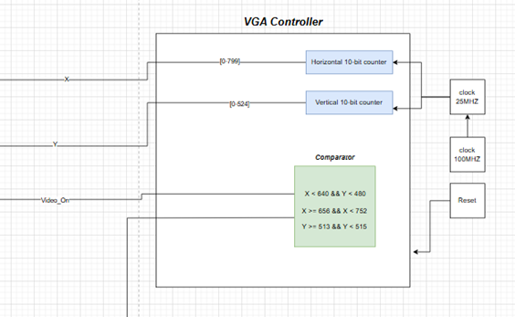
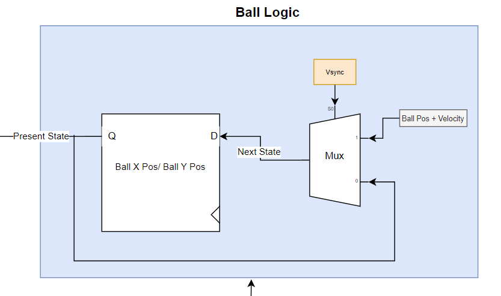
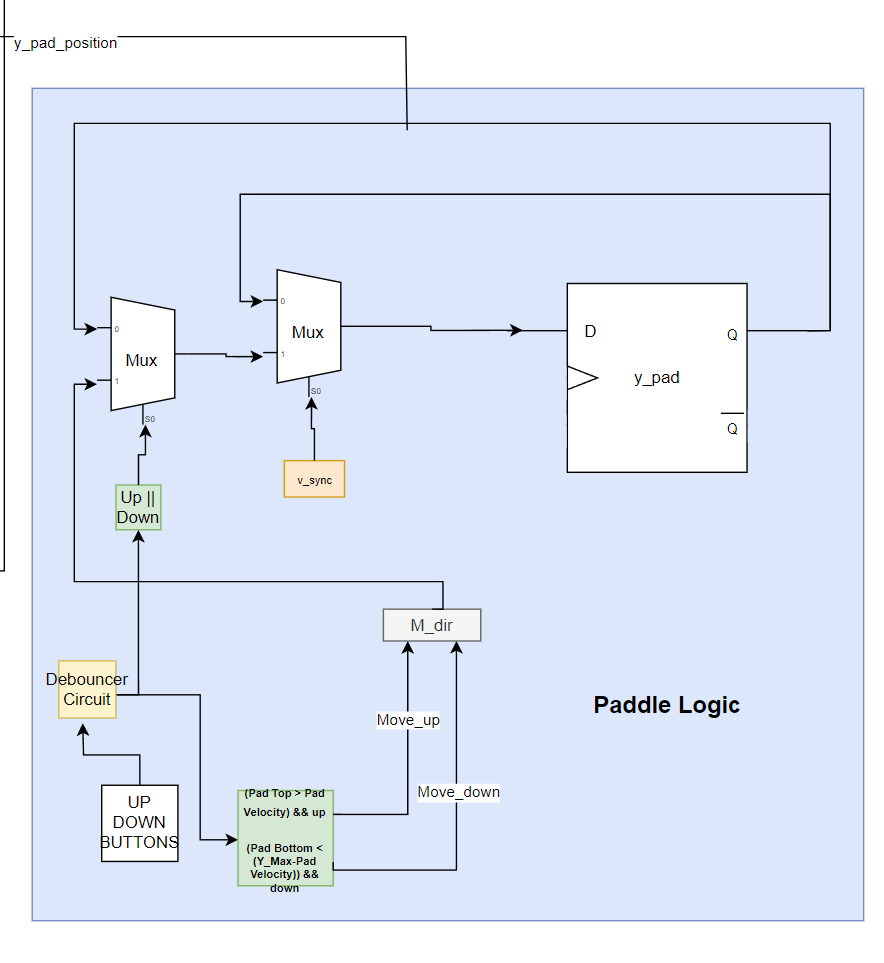
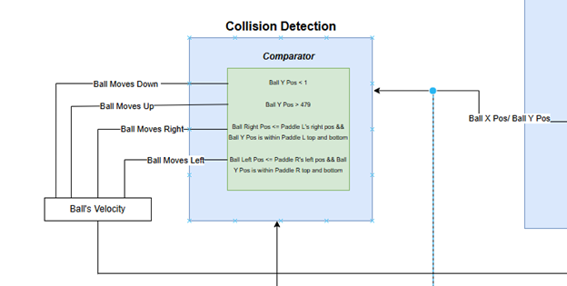
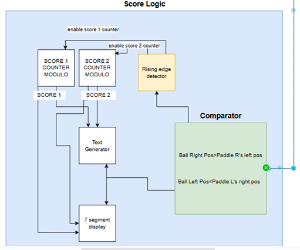
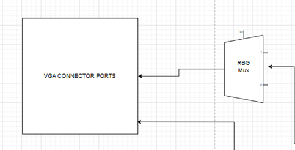

# Pong Game
🎮Pong game implemented in Verilog, running on an FPGA with VGA display.

## Desing Approach
The project consists of two main components: the VGA controller and the pixel generation circuit.

### VGA controller

As shown in the logic diagram Simply the VGA controller works by counting till the correct point in the screen to send the Vsync and Hsync signals to the screen. The VGA controller knows the right moment by comparing the count of x and y coordinates to the display dimensions.

### Pixel Generation circuit

The pixel generation circuit is responsible of generating the content that is displayed on the screen by determining which color should be displayed and sent to the RGB in every single moment using parameters for the the area where every graphical element exists in the display and comparing the current count for x and y coordinates with this parameter to determine if this element is currently on. The pixel generation circuit consists of ball logic, paddle logic, collection detection, and score logic.

## Game Logic 

### Ball Logic

The ball logic determines  the current position of the ball by either keeping it the same if there was no refresh tick or changing it to be adjusted with the ball velocity as shown in the diagram.

### Paddle Logic

The paddle logic receives input from the push buttons to either make the paddle move up or down making sure that the paddle stops when it reaches the top or the bottom of the screen.

### Collision Detection Logic

It simply works by comparing the ball position with the paddle position or the top and bottom edges of the screen and negating the ball velocity when this happens.

### Score Logic

It works by comparing the position of the ball and whether it passed the paddles or not. A rising edge detector is used to ensure a single increment in the score per point for the player. Then the enables for the counters are activated and the score is increased. The score is then displayed on the screen and on the 7-segment display in the FPGA.

### Final Stage

Based on which graphical component is on the RGB colors it is chosen to be sent to the screen with Vsync and Hsync signals.

## Modules

- **`top.v`**: Serves as the main module, connecting all parts of the project.  
- **`pixel_gen.v`**: Handles the pixel generation circuit for the project.  
- **`vga_controller.v`**: Implements the VGA controller for the monitor.  
- **`ascii_rom.v`**: Maps ASCII codes to their corresponding character representations on the screen.  
- **`Pong_text.v`**: Displays the score and textual elements in the game.  
- **`ball_rom.v`**: Represents the ball's visual appearance on the screen.  
- **`bcd_experiment1.v`**: Manages the seven-segment display functionality.  
- **`binarycounter.v`**: Implements a counter used for the clock divider.  
- **`clock_divider.v`**: Divides the clock signal for different timing requirements.  
- **`Rising_edge.v`**: Detects rising edges, utilized in the debouncer.  
- **`debouncer.v`**: Stabilizes push-button inputs on the FPGA.  
- **`Const_pong1.xdc`**: The constraint file linking the project to the FPGA.

## Challenges

We had to work on the available material even though it was not ideal for our needs. For example, the standard resolution for such games' monitors is different from the ones we had in the lab. We overcame this problem by adjusting the monitor's display settings.  
The ball logic and collision detection were tricky to implement correctly, especially when the ball was out of the screen. It was challenging to make it so that when the ball passed either the left or right edge of the screen, it would reappear at the center and travel in the opposite direction. This required careful handling of the position and velocity of the ball.

